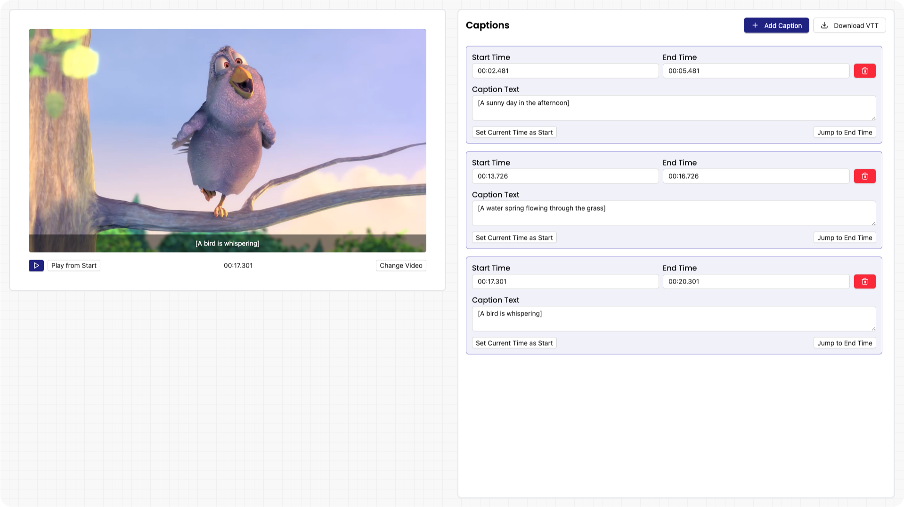

# Video Caption Editor Application

Welcome to the Video Caption Editor Application! This application allows you to add, edit, and manage captions for your videos easily.



## Features

- **Add Captions**: Easily add captions to your videos.
- **Edit Captions**: Modify existing captions with ease.
- **Export Captions**: Export your captions in various formats.

## Installation

To install the application, follow these steps:

1. Clone the repository:

```bash
git clone https://github.com/yourusername/video-caption-app.git
```

2. Navigate to the project directory:

```bash
cd video-caption-app
```

3. Install the dependencies:

```bash
npm install
```

## Usage

To start the application, run:

```bash
npm start
```

## Contributing

We welcome contributions! Please read our [contributing guidelines](CONTRIBUTING.md) for more details.

## License

This project is licensed under the MIT License. See the [LICENSE](LICENSE) file for more information.

<p align="center">

Made with ❤️ by [girishsawant999](https://girishsawant999.github.io)

</p>
